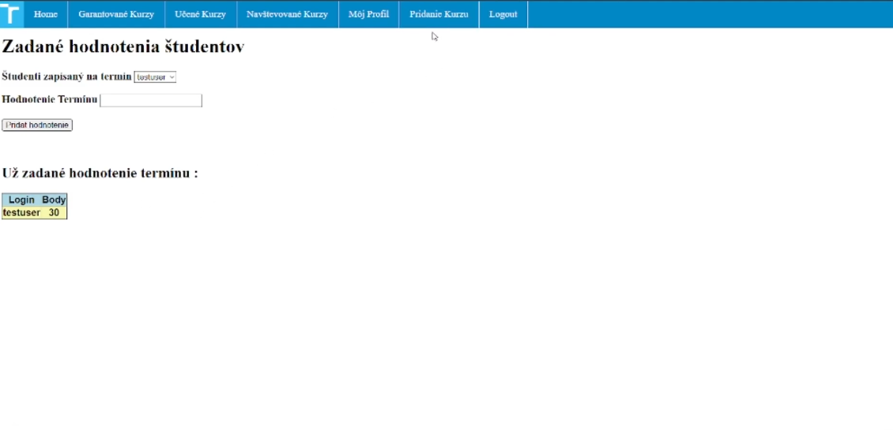

# University-Information-System

Implementation
Information system WIS2 is implemented using Flask framework.
Access to database is implemented using psycopg2 library.

We connect to database server and create cursor with witch we execute 
individual requests to database.

The passwords of users are hashed by using flask_bcrypt library and stored to each user on database server.

Database is implemented using PostgreSQL.

The Information system is no longer hosted on any hosting service.

Course Page:

Course Registration:

Evaluation:

Course Registration:

Terms:

